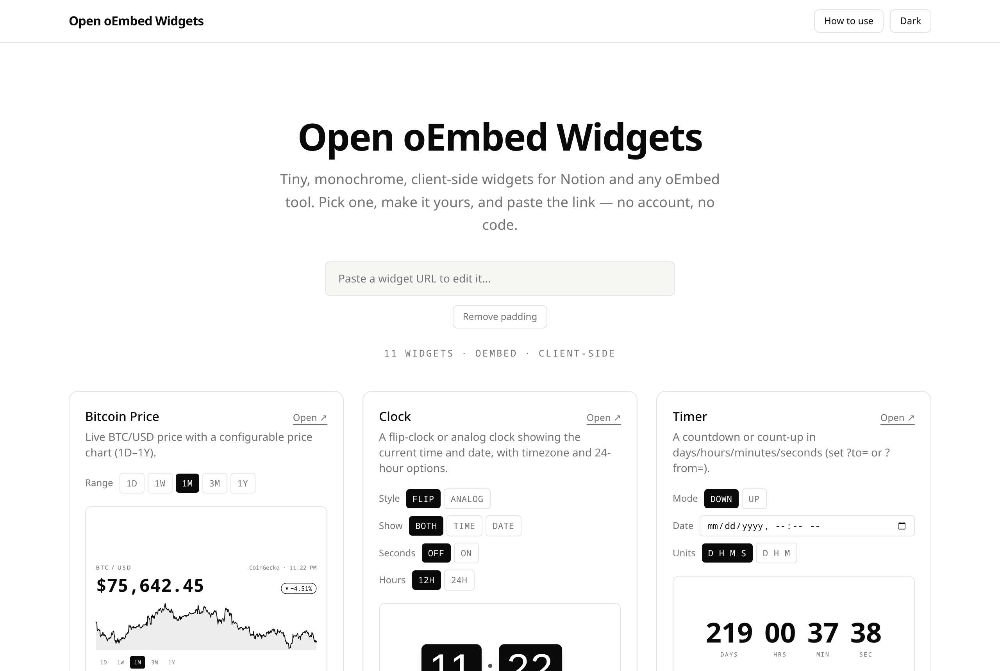

# Open oEmbed Widgets


Tiny, monochrome, **client-side** widgets you can embed in any
[oEmbed](https://oembed.com/) consumer — [Notion](https://notion.so) and others.
No backend — everything runs in the browser and is hosted on GitHub Pages.

**[Open the gallery →](https://vzsoares.github.io/open-oembed-widgets/)** ·
**[How to use](https://vzsoares.github.io/open-oembed-widgets/help/)**

[](https://vzsoares.github.io/open-oembed-widgets/)

Pick a widget, tweak it (theme, options, padding), copy the link, and paste it
into your tool — no account, no code. Widgets are transparent and scale to fit
whatever box they're embedded in.

## Widgets

| Widget        | URL          | Description                                          |
| ------------- | ------------ | ---------------------------------------------------- |
| Bitcoin Price | `/btc/`      | Live BTC/USD price + sparkline, range 1D–1Y, ~60s.   |
| Clock         | `/clock/`    | Flip or analog clock with date, timezone & 24h opts. |
| Timer         | `/timer/`    | Countdown or count-up in days/hours/minutes/seconds. |
| Image Rotator | `/images/`   | Cross-fades through a list of images on a timer.     |
| Progress      | `/progress/` | Day / week / year / custom (incl. life) progress bar.|
| On This Day   | `/onthisday/`| Notable historical events for today (Wikipedia).     |
| Weather       | `/weather/`  | Current conditions + hi/lo for a place (Open-Meteo).  |
| GitHub Card   | `/github/`   | A GitHub user or repo card with key stats.           |
| Button List   | `/links/`    | Link buttons that open in a new tab; custom colors.  |
| Quote         | `/quote/`    | A quote from a chosen collection (bundled).          |
| Bible Verse   | `/bible/`    | Random verse in English or Portuguese.               |

## Embed

1. Open the gallery, pick a theme + range, copy the URL
   (e.g. `…/open-oembed-widgets/btc/?theme=dark&range=1w`).
2. Paste the link into your tool's embed block
   (in Notion: **Create embed**, or type `/embed`).

Widgets have **transparent** backgrounds so they blend into the embedding page.
Each widget page advertises a static oEmbed document via
`<link rel="alternate" type="application/json+oembed">`, so resolvers like
Notion's (Iframely) get a proper `rich` embed.

### Config (query params)

Every widget accepts these **global** options (toggled in the gallery header /
hero, applied to all):

- **Theme** — monochrome, follows the viewer's OS light/dark preference. Pin it
  when the iframe context doesn't inherit it: `?theme=dark` / `?theme=light`.
- **Padding** — `?pad=<px>` overrides the widget's inner padding (e.g. `?pad=0`
  for edge-to-edge).
- **Scaling** — widgets render at their natural size by default; `?fit=1` scales
  them to fill the embed box (text widgets always flow/wrap regardless).

Per-widget options:

- **Range** (BTC) — initial chart window: `?range=1d|1w|1m|3m|1y` (default `1m`).
  The range buttons inside the widget stay interactive inside the embed too.
- **Clock** — `?style=flip|analog` (default `flip`), `?show=time|date|both`
  (default `both`), `?seconds=1` for a seconds tile/hand, `?h24=1` for a
  24-hour clock (default: locale), and `?tz=Area/City` for an IANA timezone
  (default: viewer's local).
- **Timer** — `?mode=down|up` (default `down`). Down counts to `?to=ISO`, up
  counts from `?from=ISO` (e.g. `?to=2026-12-31T23:59:59Z`); both default to the
  New Year if unset. The gallery's date picker emits the mode-neutral `?date=ISO`
  (used when `?to`/`?from` are absent). Also `?units=dhms|dhm`, `?label=...`
  caption, and `?done=...` text shown when a countdown hits zero.
- **Image Rotator** — `?src=url1,url2,url3` (comma-separated image URLs; falls
  back to bundled demo images if unset), `?mode=sequential|random` (default
  `sequential`), `?every=8` seconds per image, and `?fit=cover|contain`
  (default `cover`). Hover to pause. `?orient=landscape|portrait` picks the box
  shape — the widget fills either; the gallery sizes the preview and copy URL to
  match (portrait swaps to 270×480). oEmbed advertises the landscape default, so
  portrait embeds may need the iframe sized manually in strict oEmbed consumers.
- **Progress** — `?mode=day|week|year|custom` (default `year`). `custom` uses
  `?value=&max=`, a `?from=&to=` range, or a birth date + lifespan
  (`?from=2000-01-01&years=80`, i.e. life progress). `?label=` overrides the
  caption.
- **On This Day** — `?type=selected|events|births|deaths|holidays` (default
  `selected`) and `?lang=` Wikipedia language (default `en`). Hit ↻ for another
  event from the day.
- **Weather** — `?city=Tokyo` (geocoded) or `?lat=&lon=`, `?unit=c|f` (default
  `c`), `?label=` place-name override. Defaults to London if unset.
- **GitHub Card** — `?user=login` or `?repo=owner/name`. Unauthenticated, so
  the public API allows ~60 requests/hour per viewer IP.
- **Button List** — `?btns=Text|https://url|hex` with `;` between buttons (e.g.
  `?btns=Site|https://x.com|1d9bf0;Docs|https://x.com/docs`); only http/https/
  mailto URLs are allowed. `?layout=list|row` (default `list`).
- **Quote** — `?collection=motivation|wisdom|stoic|tech` (default `motivation`);
  quotes are bundled (no API). Hit ↻ for another.
- **Language** (Bible) — `?lang=en|pt` (default: viewer's locale). EN/PT buttons
  stay interactive in the embed.

The gallery also has a **paste-a-URL** box: paste any widget URL above the cards
to load its theme + options back into the UI for further editing.

## Architecture

- **Multi-page** Vite build — one HTML entry per widget gives each a stable
  embed URL (`/btc/`).
- **Static oEmbed** — `scripts/gen-oembed.ts` reads `src/widgets/manifest.ts`
  and writes `dist/<id>/oembed.json` after the Vite build.
- **Resilient data** — the BTC chart tries CoinGecko → Binance → Coinbase
  (all public, key-less, CORS-enabled) and uses the first that answers. The
  Bible widget uses bible-api.com and falls back to a bundled verse list if the
  API is unreachable, so it always renders.
- **No-dependency chart** — a hand-built SVG sparkline (`chart.ts`), monochrome.
- **Config via manifest** — each widget declares `params` (range, language, …);
  the gallery renders selectors and bakes them into the embed URL.

```
/
├── index.html                # widget gallery (home)
# one <id>/index.html per widget: btc, clock, timer, images, progress,
# onthisday, weather, github, links, bible (all embeddable pages)
├── btc/index.html
├── clock/index.html
├── …                         # progress/, onthisday/, weather/, github/, links/, …
├── public/demo/              # bundled demo images for the rotator
├── src/
│   ├── home.ts               # gallery logic (incl. paste-URL import)
│   ├── styles.css            # Tailwind + monochrome theme vars
│   ├── lib/                  # theme.ts, duration.ts, interval.ts (+ *.test.ts)
│   └── widgets/
│       ├── manifest.ts       # widgets + params (single source)
│       ├── btc/              # index.ts, price.ts, chart.ts, *.test.ts
│       ├── clock/            # index.ts, time.ts, time.test.ts
│       ├── timer/            # index.ts, config.ts, config.test.ts
│       ├── images/           # index.ts, config.ts, config.test.ts
│       ├── progress/         # index.ts, progress.ts, progress.test.ts
│       ├── onthisday/        # index.ts, events.ts, events.test.ts
│       ├── weather/          # index.ts, weather.ts, weather.test.ts
│       ├── github/           # index.ts, github.ts, github.test.ts
│       ├── links/            # index.ts, links.ts, links.test.ts
│       ├── quote/            # index.ts, quote.ts, quotes.json, quote.test.ts
│       └── bible/            # index.ts, verse.ts, fallback.json, *.test.ts
├── e2e/                      # Playwright end-to-end specs
├── scripts/gen-oembed.ts     # post-build oEmbed JSON generator
├── playwright.config.ts
├── vitest.config.ts
└── vite.config.js
```

## Develop

Requires [Bun](https://bun.sh).

```bash
bun install
bun run dev          # http://localhost:5173  (and /btc/)
bun run test         # unit tests (vitest, src/)
bun run test:watch   # unit tests in watch mode
bun run test:e2e     # Playwright e2e (uses your system Chrome locally)
bun run typecheck    # tsc, both app + tooling configs
bun run lint         # biome check
bun run format       # biome check --write
bun run build        # vite build + oEmbed generation -> dist/
bun run preview      # serve the production build
```

On push to `main`, CI runs lint, typecheck, unit + e2e tests, and only then
builds and deploys to GitHub Pages (`.github/workflows/deploy.yml`).

## Add a widget

1. Add an entry to `src/widgets/manifest.ts`.
2. Create `<id>/index.html` + `src/widgets/<id>/index.ts`.
3. Register the page in `vite.config.js` (`build.rollupOptions.input`).

oEmbed JSON and the gallery card are generated from the manifest. See
[CONTRIBUTING.md](CONTRIBUTING.md) for the full workflow, config-param types,
and the quality checks to run.

## License

[MIT](LICENSE) · Created by [vzsoares](https://github.com/vzsoares)
